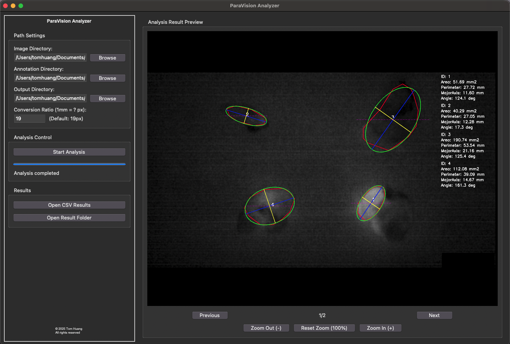

# ParaVision Analyzer
[](https://www.buymeacoffee.com/huang422)

## Parathyroid Pattern Recognition Computer Vision System

[](https://www.python.org/downloads/)
[](https://opencv.org/)


A comprehensive medical image analysis tool for automated parathyroid tumor detection, feature extraction, and quantitative analysis. This tool processes annotated medical images to extract morphological, textural, and intensity features, providing objective measurements to assist medical professionals and researchers.

## Demo



*Example output showing automated tumor detection with fitted ellipse, major/minor axes, and quantitative measurements*

## Table of Contents

- [Overview](#overview)
- [Features](#features)
- [Installation](#installation)
- [Quick Start](#quick-start)
- [Data Directory Structure](#data-directory-structure)
- [Usage](#usage)
- [Feature Extraction](#feature-extraction)
- [Project Structure](#project-structure)
- [Requirements](#requirements)
- [Documentation](#documentation)
- [License](#license)

## Overview

ParaVision Analyzer is a Python-based medical image analysis tool designed for parathyroid tumor feature extraction and quantitative analysis. The system processes medical images with polygon annotations (created using LabelMe) and automatically extracts **40+ features** including:

- **Morphological features**: Area, perimeter, circularity, aspect ratio
- **Shape descriptors**: Ellipse fitting, Feret's diameter, convexity, solidity
- **Intensity statistics**: Mean, median, standard deviation, skewness, kurtosis
- **Texture features**: GLCM-based features (contrast, homogeneity, energy, correlation, entropy)

The tool provides both a user-friendly GUI application and command-line functionality, making it suitable for both clinical workflows and research pipelines.

## Features

### Core Capabilities

- **Automated Feature Extraction**: 40+ quantitative features per annotated region
- **Batch Processing**: Process multiple images and annotations simultaneously
- **Visual Analysis**: Generate annotated images showing detected regions, fitted ellipses, and measurements
- **Flexible Units**: Configurable pixel-to-physical unit conversion
- **Comprehensive Output**: Structured CSV results with all measurements
- **Interactive GUI**: User-friendly interface with real-time preview and navigation
- **Command-Line Interface**: Scriptable batch processing for automation
- **Modular Architecture**: Clean, maintainable code structure

## Installation

### Prerequisites

- **Python**: 3.7 or higher
- **Operating System**: Windows, macOS, or Linux

### Method 1: Using pip (Recommended)

```bash
# Clone the repository
git clone https://github.com/huang422/ParaVision-Analyzer.git
cd ParaVision-Analyzer

# Install dependencies
pip install -r requirements.txt

# Install the package in development mode
pip install -e .
```

### Method 2: Manual Installation

```bash
# Install dependencies individually
pip install numpy pandas opencv-python matplotlib scipy scikit-image Pillow
```

### Verify Installation

```bash
python -c "import paravision_analyzer; print(paravision_analyzer.__version__)"
```

## Quick Start

### Using the GUI Application

```bash
# Run the GUI
python scripts/run_gui.py
```

1. Set your directory paths:
   - **Image Directory**: `data/images`
   - **Annotation Directory**: `data/annotations`
   - **Output Directory**: `data/results`
2. Configure conversion ratio (default: 19 pixels = 1mm)
3. Click "Start Analysis"
4. View results in the preview panel

### Using the Command Line

```bash
python scripts/run_cli.py \
    --image-dir data/images \
    --annotation-dir data/annotations \
    --output-dir data/results \
    --px-per-mm 19
```

### Using as a Python Package

```python
from paravision_analyzer import ParathyroidTumorAnalyzer

# Initialize analyzer
analyzer = ParathyroidTumorAnalyzer(
    image_dir="data/images",
    json_dir="data/annotations",
    output_dir="data/results",
    px_per_mm=19
)

# Run analysis
analyzer.analyze_all_images()
```

## Data Directory Structure

### IMPORTANT: Data Files Are NOT Uploaded to Git

The `data/` directory and its contents (medical images, annotations, and results) are **excluded from Git** for privacy and security reasons. See [.gitignore](.gitignore) for details.

### Required Directory Structure

```
data/
├── README.md            # Data directory documentation (included in Git)
├── images/              # Medical images (NOT in Git)
│   ├── .gitkeep        # Keeps directory structure
│   ├── image_1.jpg
│   ├── image_2.png
│   └── ...
├── annotations/         # LabelMe JSON annotations (NOT in Git)
│   ├── .gitkeep
│   ├── image_1.json     # Must match image_1.jpg
│   ├── image_2.json     # Must match image_2.png
│   └── ...
└── results/            # Analysis output (NOT in Git)
    ├── .gitkeep
    ├── parathyroid_analysis_results.csv
    └── visualizations/
        ├── image_1_analysis.png
        ├── image_2_analysis.png
        └── ...
```

### Setting Up Your Data

1. **Prepare Images**:
   - Place medical images in `data/images/`
   - Supported formats: JPG, JPEG, PNG, BMP
   - Ensure images are anonymized (no patient identifiable information)

2. **Create Annotations**:
   - Use [LabelMe](https://github.com/wkentaro/labelme) to annotate images
   - Save JSON files in `data/annotations/`
   - **Critical**: Annotation files must have the **same filename** as images (except extension)
   - Minimum 5 points per polygon for ellipse feature extraction

3. **Run Analysis**:
   - Results automatically generated in `data/results/`
   - CSV file contains all extracted features
   - Visualizations folder contains annotated images

**For detailed data setup instructions, see [data/README.md](data/README.md)**

## Usage

### GUI Application Features

The GUI provides:
- Path configuration for images, annotations, and output
- Real-time progress tracking
- Image preview with zoom and pan
- Navigation through analyzed images
- Quick access to results (CSV and visualizations)

### Command-Line Options

```bash
python scripts/run_cli.py --help
```

**Arguments:**
- `--image-dir`: Directory containing medical images (required)
- `--annotation-dir`: Directory containing JSON annotations (required)
- `--output-dir`: Directory for output results (required)
- `--px-per-mm`: Pixel to millimeter conversion ratio (default: 19)

### Creating Annotations with LabelMe

1. **Install LabelMe**: Download from [GitHub Releases](https://github.com/wkentaro/labelme/releases)
2. **Open Image**: Load your medical image
3. **Create Polygon**:
   - Click "Create Polygons"
   - Mark tumor boundary with at least 5 points
   - Right-click to close polygon
4. **Save**: Annotation saved as `[image_name].json`

**For detailed annotation instructions, see [data/README.md](data/README.md)**

## Feature Extraction

### Extracted Features (40+)

#### 1. Basic Measurements
- Area (pixels and mm²)
- Perimeter (pixels and mm)
- Image and tumor identification

#### 2. Intensity Features
- Mean, Median, Min, Max intensity
- Standard deviation
- Binary mean intensity (Otsu's threshold)
- Skewness and Kurtosis

#### 3. Shape Features
- Circularity
- Aspect Ratio
- Irregularity Index
- Convexity
- Solidity
- Feret's Diameter
- Area Fraction

#### 4. Ellipse Features
- Ellipse area and perimeter
- Major and minor axis lengths (pixels and mm)
- Major and minor axis angles

#### 5. Texture Features (GLCM)
- Contrast
- Homogeneity
- Energy
- Correlation
- Dissimilarity
- ASM (Angular Second Moment)
- Entropy

### Visualization Output


Each analyzed image shows:
- **Red outline**: Annotated tumor boundary
- **Green ellipse**: Fitted ellipse
- **Blue line**: Major axis
- **Yellow line**: Minor axis
- **Purple dashed line**: Horizontal reference
- **Text overlay**: ID, area, perimeter, major axis, angle

**For detailed feature descriptions, see [docs/Instruction.md](docs/Instruction.md)**

## Project Structure

```
ParaVision-Analyzer/
├── paravision_analyzer/       # Main package
│   ├── __init__.py           # Package initialization
│   ├── core/                 # Core analysis modules
│   │   ├── __init__.py
│   │   ├── analyzer.py       # Main analyzer class
│   │   ├── features.py       # Feature extraction
│   │   └── utils.py          # Utility functions
│   └── gui/                  # GUI application
│       ├── __init__.py
│       └── application.py    # GUI implementation
├── scripts/                   # Execution scripts
│   ├── run_gui.py            # Launch GUI
│   └── run_cli.py            # Command-line interface
├── data/                      # Data directory (NOT in Git)
│   ├── README.md             # Data setup instructions
│   ├── images/               # Medical images
│   ├── annotations/          # LabelMe annotations
│   └── results/              # Analysis output
├── docs/                      # Documentation
│   ├── Instruction.md        # Feature descriptions
│   └── img/                  # Documentation images
├── quick_start.py             # Main entry point
├── requirements.txt           # Python dependencies
├── .gitignore                 # Git ignore rules
└── README.md                  # This file
```

## Requirements

### Software Requirements

- **Python**: 3.7 or higher
- **Operating System**: Windows, macOS, or Linux

### Python Dependencies

- `opencv-python` (cv2): Image processing and computer vision
- `numpy`: Numerical computations
- `pandas`: Data manipulation and CSV output
- `matplotlib`: Visualization and plotting
- `scipy`: Statistical analysis
- `scikit-image`: Texture feature extraction (GLCM)
- `Pillow` (PIL): Image handling for GUI
- `tkinter`: GUI framework (usually included with Python)

### Hardware Requirements

- **RAM**: 4GB minimum, 8GB recommended
- **Storage**: Sufficient space for images and results
- **Display**: 1280x720 minimum resolution for GUI

## Documentation

- **[README.md](README.md)** - This file (English)
- **[README_zh-TW.md](README_zh-TW.md)** - 繁體中文文檔
- **[docs/Instruction.md](docs/Instruction.md)** - Detailed feature descriptions and calculations
- **[data/README.md](data/README.md)** - Data directory setup and guidelines

## Contributing

This is a proprietary project developed for medical research. Contributions are limited to authorized personnel.

## License

© 2025 Tom Huang. All rights reserved.

### Third-Party Tools

- [LabelMe](https://github.com/wkentaro/labelme): Image annotation tool
- [OpenCV](https://opencv.org/): Computer vision library
- [scikit-image](https://scikit-image.org/): Image processing in Python

## Contact

For questions, issues, or collaboration inquiries:
- **Developer**: Tom Huang
- **Email**: huang1473690@gmail.com

## Troubleshooting

### Common Issues

**Issue**: "Image file not found"
- **Solution**: Ensure image and annotation filenames match (except extensions)

**Issue**: "Ellipse features are NaN"
- **Solution**: Annotations must have at least 5 points

**Issue**: "Cannot read image"
- **Solution**: Check if the image format is supported (JPG, PNG, BMP)

**Issue**: "No analyzable images found"
- **Solution**:
  - Verify `data/images/` and `data/annotations/` contain matching files
  - Check filenames match exactly (except extensions)
  - Ensure JSON files are valid LabelMe format

**For more troubleshooting, see [data/README.md](data/README.md)**

---

**Version**: 1.0.0
**Last Updated**: April 2025
**Status**: Production Ready

**Language**: [English](README.md) | [繁體中文](README_zh-TW.md)


